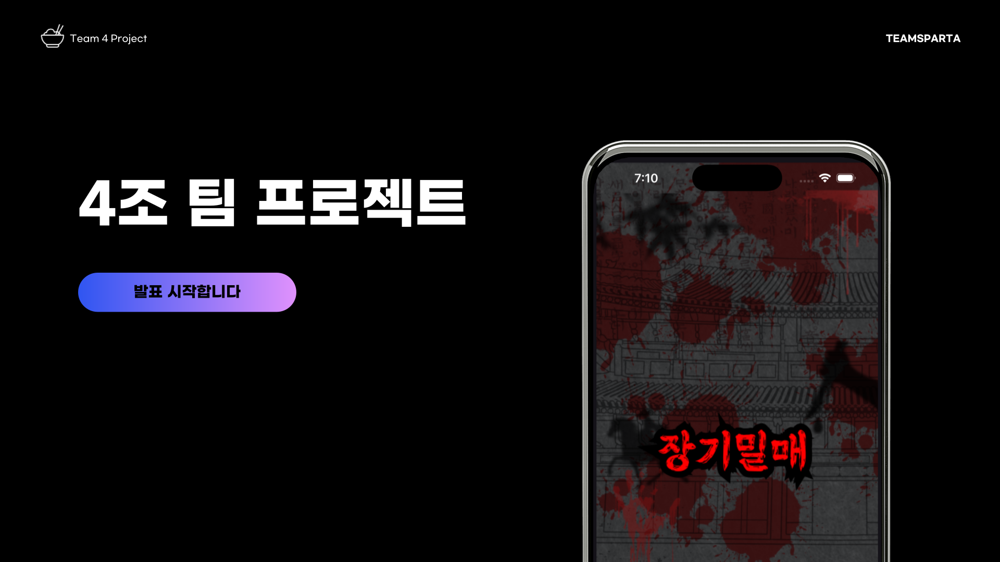
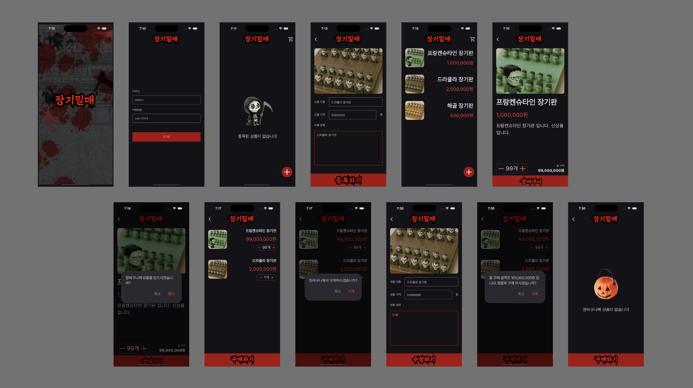

<h1 align="center">
장기밀매
</h1>

 

## 프로젝트 개요
### “장기밀매" 는 공포 컨셉 장기용품 쇼핑몰 입니다.

#### 💡 '장기밀매'는 다음과 같은 분들을 위해 탄생되었습니다.

> ♟️ 평소에 장기 두기를 좋아하고 장기에 대해 관심이 많으신 분들
> 

> ✨ 비슷한 디자인의 장기용품에 지루함을 느끼고, 새로운 디자인을 찾고 계시는 분들 
> 

> 🛍️ 합리적인 가격에 다양한 장기용품을 사고 팔고 싶으신 분들
> 

 

## 팀원 구성

| **이경범** | **안혜린** | **권태윤** | **박한결** |
| :------: |  :------: | :------: | :------: |

### 프로젝트 일정
25/10/24~25/10/30

### 레퍼런스
- Google 공식 문서: Flutter, Dart
- Figma (Wireframe 제작)
- Miri Canvas

### 프로젝트 핵심 기술
- Flutter 기반 멀티 플랫폼 지원(Android, iOS)
- Dart 언어 활용
- MVVM
- webp
- fluttertoast: ^9.0.0
- image_picker: ^0.8.7+5
- intl: ^0.20.2
- auto_size_text: ^3.0.0

### 앱 디자인 설계

  
### 역할 분담
- **이경범** : 👑팀장, 홈 페이지(상품 리스트 + 빈 리스트 페이지), 오류 수정

- **안혜린** : 상품 등록 페이지, 스플레시 페이지, 로그인 페이지, ReadMe

- **권태윤** : 장바구니 페이지, 상품 수정 페이지, 와이어 프레임 및 앱 디자인

- **박한결** : 상품 상세 페이지, 발표 자료, 와이어 프레임 및 앱 디자인

 

## 주요 기능

| [로그인 페이지] | [홈 페이지] | [상품 등록 페이지] | [상품 상세 페이지] | [상품 수정 페이지] | [장바구니 페이지] |
| --- | --- | --- | --- | --- | --- |
| - 등록되어 있는 아이디, 비밀번호를 통해 로그인하기| - 현재 등록되어 있는 상품 목록 보기 - 상품 목록을 눌러 상품 상세정보 보기 - 상품 목록을 길게 눌러 상품 수정하기 - 상품 추가하기 - 장바구니 보기| - 등록할 상품의 사진 넣기 - 등록할 상품의 이름 입력 - 등록할 상품의 가격 입력 - 등록할 상품의 상세정보 입력| - 선택한 상품의 상세정보 보기 - 장바구니에 담을 수량 선택 - 장바구니에 담은 상품의 총 가격 확인 - 선택한 상품 장바구니에 담기| - 선택한 상품의 정보(사진, 이름, 가격, 상세정보) 수정 | - 장바구니에 담은 상품 목록 보기 - 장바구니에 담은 상품의 수량 및 총 가격 보기 - 장바구니에 담은 상품 삭제 - 장바구니에 담은 상품 구매하기 |

 

## TroubleShooting

#### 팀 프로젝트 주제 및 컨셉 결정
- 배경 : 쇼핑몰 앱의 주제를 정하다 차별화와 임팩트를 줄 수 있도록 ‘장기밀매’ 로 결정함
- 문제 : 앱이 전반적으로 어둡고 공포감을 조성하며 사용자들에게 해로운 영향을 끼칠 가능성이 우려됨, 팀 외부에서 앱의 주제 및 컨셉이 캠프 내에서 진행하기에 부적절하다는 피드백을 받음
- 개선 : 할로윈 시즌에 어울리는 공포 컨셉의 ‘장기용품 쇼핑몰’ 로 결정함

#### Git 협업 시 충돌 현상
- 배경 : 브랜치 분화 후 각자 담당한 기능을 작업함
- 문제 : 충돌이 일어나 merge 가 불가능하거나 대량의 충돌 부분을 일일이 수정해야하는 문제가 발생, 타 브랜치에서 pull 하는 과정이 (변경된 사항이 반영되지 않는 등) 제대로 이루어지지 않음
- 개선 : 브랜치 작업 시 팀원 다같이 소통하며 룰을 지키도록 함 
1. 작업 중 충돌이 있을 만한 부분 (다른 팀원이 담당한 페이지의 코드를 수정 등) 이 있을 시 미리 소통하기
2. 각자의 브랜치에서 작업 완료 후 push 하기 직전에 한 번 더 pull 하기
3. main 브랜치로 merge 된 후, 나머지 브랜치에서 다같이 pull 하기
4. main 브랜치로 merge 된 브랜치는 삭제하고 (기능 구현 완료됨), 추후 작업 시 기능에 맞는 브랜치를 그 시점에 새로 만들어서 작업하기

 

## 유지보수 및 개선사항

추후 추가 예정
